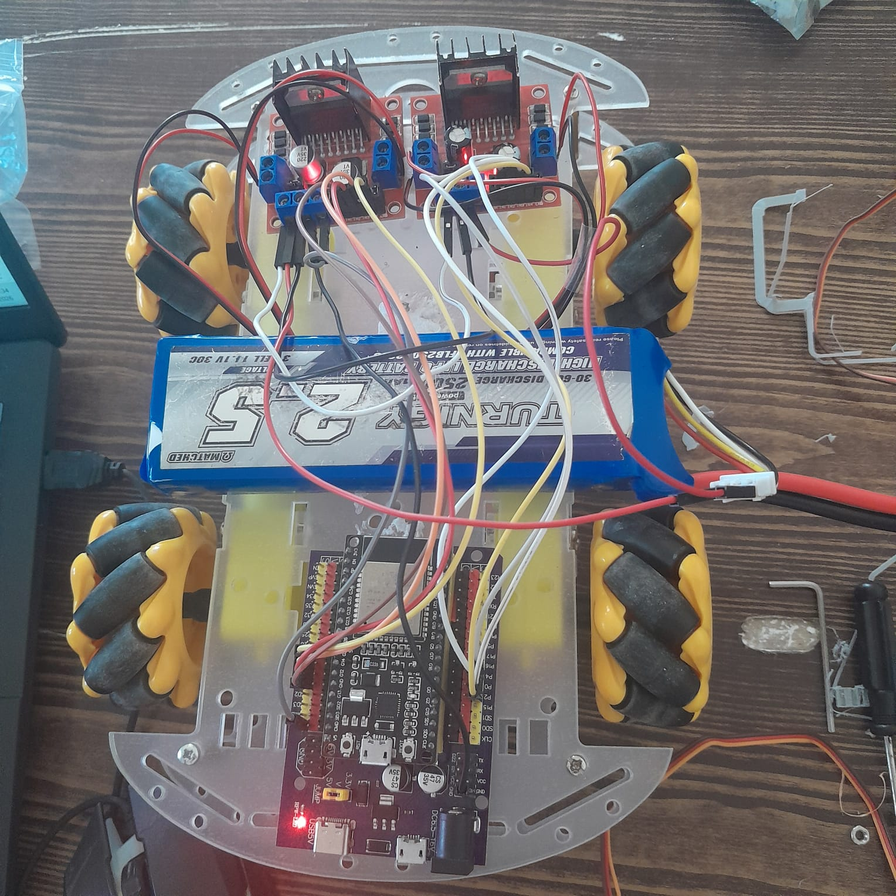
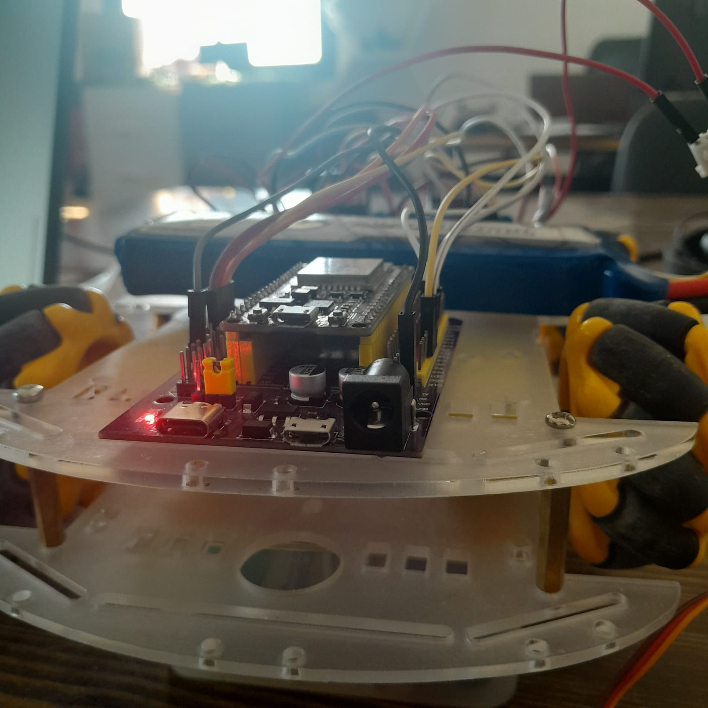
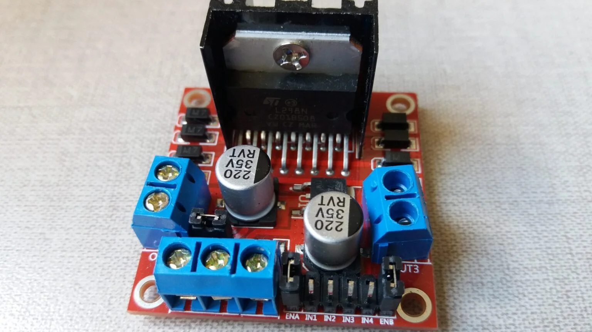
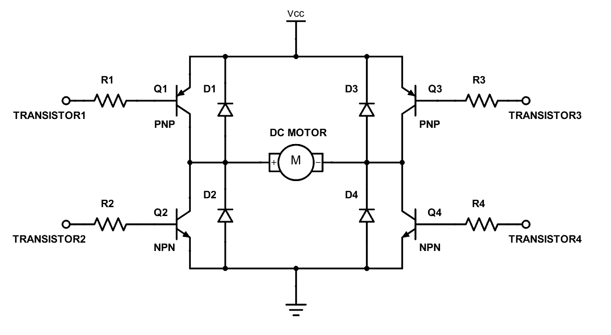
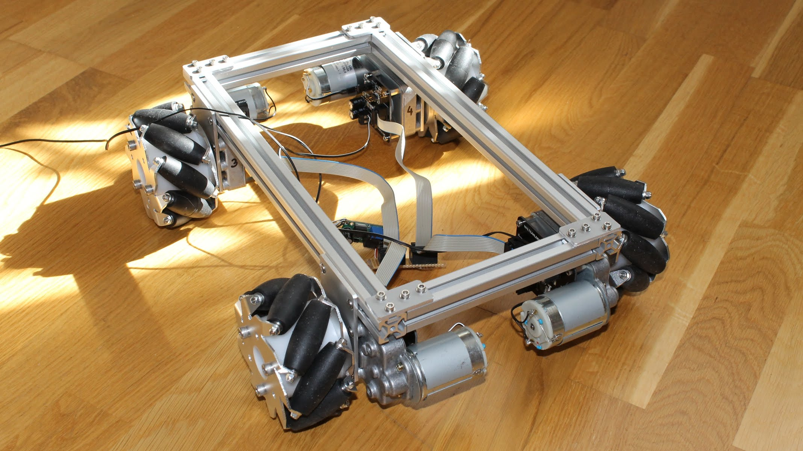
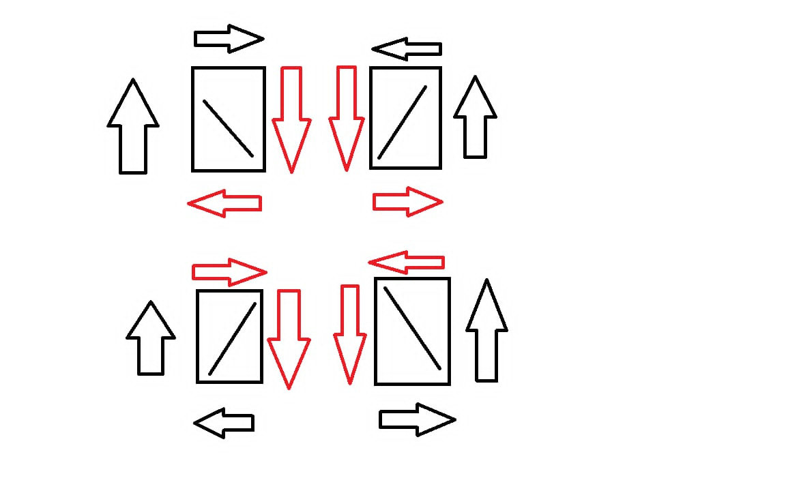

 

 

## 🎯 About the Project

<table>
<tr>
<td width="60%" valign="top">

An **ESP32-powered mecanum car** developed collaboratively by **Emna Ben Ali** and **Mohamed Ben Ali**.

This project demonstrates how mecanum wheels enable smooth **360° omnidirectional movement**, allowing the car to move forward, backward, sideways, diagonally, and rotate in place without changing its orientation.

The car is controlled wirelessly over **WiFi**, providing responsive real-time control through a web interface. Built using embedded systems, robotics, and wireless communication, it serves as a practical platform for learning and experimentation.

</td>
<td>

</td>
</tr>
</table>

<video src="https://github.com/user-attachments/assets/735bc008-01eb-4c23-955c-d4ed90044f93" controls muted width="600"></video>

> 🎥 Live demo showing forward, strafe, diagonal, and rotation control.

---

## 🎯 Objectives

- Design a 4-wheel mecanum chassis for full omnidirectional motion
- Implement independent PWM control for each motor using ESP32
- Develop an ESP32 web server for real-time wireless control
- Create a responsive browser-based control interface

---

## ✨ Key Features

| 🚀 | Feature | Description |
|:--:|:--------|:------------|
| 🕹️ | Omnidirectional Movement | Move in any direction without chassis rotation |
| 🔄 | In-place Rotation | Rotate 360° on the spot |
| 📡 | WiFi Control | Control the robot from any device on the same network |
| ⚡ | Real-Time Response | Low-latency command execution |
| 🎨 | Web Interface | Simple and intuitive directional control |
| 🔧 | Modular Code | Separated motor, WiFi, and control logic |

---

## 🧠 How It Works

The robot uses an ESP32 to receive movement commands over WiFi from a web interface.

Each command is translated into motor signals using PWM control. By adjusting the speed and direction of the four mecanum wheels independently, the robot can move in any direction or rotate in place.

The ESP32 continuously listens for incoming commands and updates motor outputs in real time for smooth control.

---

## 🔧 Build Process (Electronics & Wiring)

This section explains how the mechanical and electronic parts of the robot are connected, from motors to ESP32 control.

> 🖼️ *Overview of the electronics layout — ESP32, motor drivers, and wiring connections.*

## ⚙️ Motor Driver Setup (Dual H-Bridge)

The robot uses **two H-bridge drivers** to control four DC motors:

- Left side motors → H-Bridge 1
- Right side motors → H-Bridge 2

Each motor is controlled using:
- Digital pins → direction
- PWM signal → speed

This setup ensures stable current handling and simplifies wiring for the mecanum system.

> 🖼️ *Dual H-bridge motor driver .*

### 🧠 H-Bridge Working Principle

| IN1 | IN2 | Motor Direction |
|-----|-----|----------------|
| 1   | 0   | Forward        |
| 0   | 1   | Backward       |
| 0   | 0   | Stop           |
| 1   | 1   | Brake          |

### 🔌 2. ESP32 to Dual Motor Driver Wiring

The ESP32 controls **two H-bridge motor drivers**, each responsible for two motors (left and right sides).  
Each motor uses **two GPIO pins** for direction control, while speed is managed using PWM.

### 🚗 Motor Mapping

| Wheel | ESP32 Pins | Motor Driver |
|------|------------|--------------|
| Back Left (BL) | GPIO 12, GPIO 13 | H-Bridge 1 (IN1 / IN2) |
| Front Left (FL) | GPIO 14, GPIO 27 | H-Bridge 1 (IN3 / IN4) |
| Front Right (FR) | GPIO 2, GPIO 0 | H-Bridge 2 (IN1 / IN2) |
| Back Right (BR) | GPIO 16, GPIO 4 | H-Bridge 2 (IN3 / IN4) |

---

## 🔌 Electronics

| Component | Role |
|:---|:---|
| **ESP32 Dev Board** | Main controller — WiFi server + motor logic |
| **2× H-Bridge Motor Drivers** | Independent direction + PWM speed control per side |
| **4× DC Motors** | One per mecanum wheel |
| **Battery Pack** | Powers motors and ESP32, separate rails recommended |
| **Jumper Wires / Connectors** | GPIO-to-driver and driver-to-motor wiring |

> 🖼️ *All electronic components after wiring.*

---

## 🧩 How Mecanum Wheels Work (Mechanically)
 
Each mecanum wheel has small **rollers** around its rim, angled at **45°**. These rollers spin freely on their own, separate from the wheel's rotation.
 
When the wheel spins, the angled rollers push the force in two directions at once — partly forward, partly sideways.
 

> 🖼️ *Simulation showing how the roller angle splits the force into forward and sideways motion.*
 
**The four wheels work as a team.** They're mounted so each wheel's rollers angle opposite to its diagonal partner. By spinning each wheel at a different speed and direction, the robot can move any way — forward, sideways, diagonal, or spin in place — with no steering parts at all.
 
| Motion | FL | FR | BL | BR |
|:---|:---:|:---:|:---:|:---:|
| Forward | + | + | + | + |
| Backward | − | − | − | − |
| Strafe Right | + | − | − | + |
| Strafe Left | − | + | + | − |
| Diagonal ↗ | + | 0 | 0 | + |
| Diagonal ↖ | 0 | + | + | 0 |
| Rotate CW | + | − | + | − |
| Rotate CCW | − | + | − | + |
 
*(+ = spins forward, − = spins backward, 0 = stays still)*
 
📺 [The Simple Mechanics of Mecanum Wheels](https://www.youtube.com/watch?v=0k-Ey9bS9lE)

> 🖼️ *Chassis and mecanum wheel assembly.* after that
